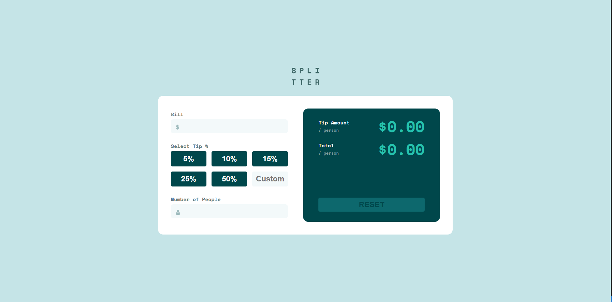

# Tip Calculator App

A responsive website that helps users easily calculate bills and tips when going out. This app makes it simple to split the total bill among any number of people and lets you select or enter a custom tip percentage. The unique feature is the ability to enter the group size, so you can see the tip and total amount per person, perfect for group outings!



**Live Demo:**  
[https://jayco01.github.io/tip-calculator-app/](https://jayco01.github.io/tip-calculator-app/)

---

## Features

- Input the bill amount, choose a tip (or enter your own), and enter how many people to split with.
- Instantly see the tip amount and total per person.
- Error handling for invalid group sizes (e.g. entering 0 people).
- Fully responsive design using plain HTML, CSS, and vanilla JavaScript (no frameworks).

---

## How to Use

1. **Clone or Download:**  
   Download or clone this repo to your computer.

2. **Open the App:**  
   Simply open `index.html` in your browser. No build tools or installation required.

---

## Code Highlights

### 1. Using `forEach` to Add Event Listeners

This project uses JavaScript's `forEach` method to efficiently add event listeners to all the tip percentage buttons, making the code cleaner and easier to scale.

```js
// Add event listeners to all tip buttons
tipButtons.forEach(btn => {
  btn.addEventListener('click', function() {
    tipPct = parseFloat(this.textContent.replace('%', '')) / 100;
    customTip.value = '';
    calculateTipAmount();
    calculateTotal();
    activateReset();
  });
});

// Set active state on clicked tip button
tipButtons.forEach(btn => {
  btn.addEventListener("click", function() {
    tipButtons.forEach(b => b.classList.remove("active"));
    this.classList.add("active");
  });
});
```

### 2. Robust Calculation Functions

The following functions handle calculation of the tip amount and total per person. They ensure that invalid or empty input never results in broken UI, defaults to `$0.00` for any invalid calculation.

```js
function calculateTipAmount() {
    let tipTotal = billValue * tipPct;
    let tipPerPerson = tipTotal / peopleValue;
    if (tipPerPerson == Infinity) {
        tipAmount.innerHTML = '$0.00';
    } else if (tipPerPerson) {
        tipAmount.innerHTML = '$' + tipPerPerson.toFixed(2);
    } else {
        tipAmount.innerHTML = '$0.00';
    }
}

function calculateTotal() {
    let totalPerPerson = (billValue + (billValue * tipPct)) / peopleValue;
    if (totalPerPerson == Infinity) {
        total.innerHTML = '$0.00';
    } else if (totalPerPerson) {
        total.innerHTML = '$' + totalPerPerson.toFixed(2);
    } else {
        total.innerHTML = '$0.00';
    }
}
```
